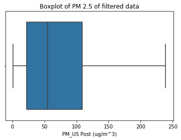
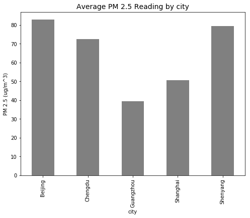
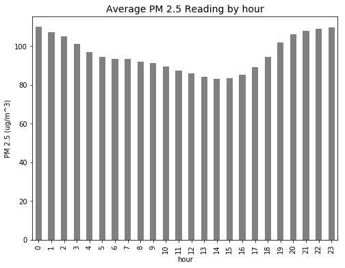
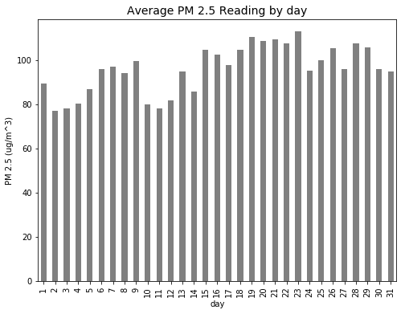
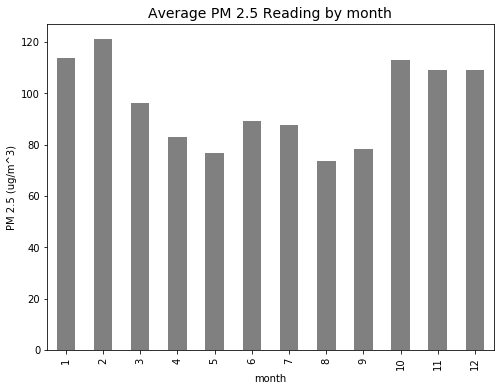
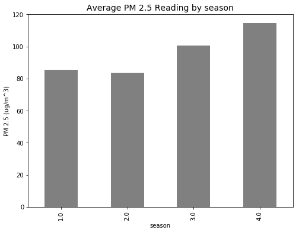
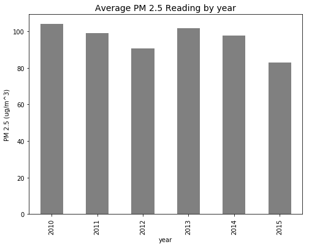
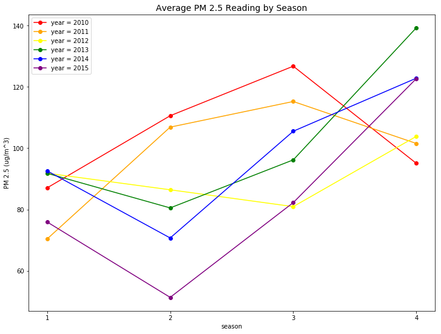
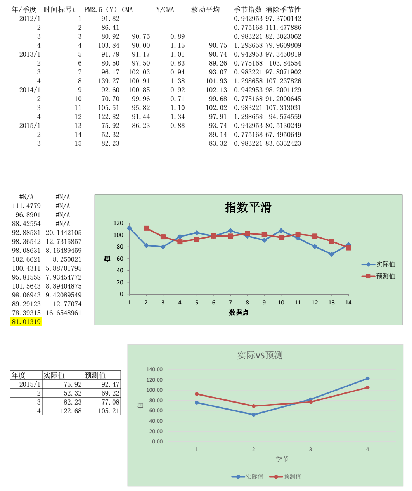

# 北京市 PM 2.5 数据的统计分析

## 项目背景

PM2.5 的检测数值通常包含在环境部门和公司的空气质量报告中。 PM2.5 是指大气颗粒物（PM），其直径小于或等于2.5微米。在环境科学中，特指悬浮在空气中的固体颗粒或液滴，是空气污染的主要来源之一。

## 提出问题
1. 分析北京市 2015 年的 PM2.5 数据的分布情况，并和其他主要城市对比，判断北京市 PM2.5 的严重程度
2. 分析北京市 PM2.5 的变化趋势，包括每天的变化趋势、每月的变化趋势以及 2010-2015 年变化趋势
3. 使用时间序列预测的方法，结合上面分析得到的结论，对 2015 年的数据做出预测。


## 观察数据

本数据包含有中国五个城市(北京、上海、成都、广州、沈阳)从2010/1/1-2015/12/31的空气和气象数据。数据中的缺失值被标记为NaN。数据列名的含义如下：

```
No: 行号
year: 年份
month: 月份
day: 日期
hour: 小时
season: 季节
PM: PM2.5浓度 (ug/m^3)
DEWP: 露点 (摄氏温度) 指在固定气压之下，空气中所含的气态水达到饱和而凝结成液态水所需要降至的温度。
TEMP: Temperature (摄氏温度)
HUMI: 湿度 (%)
PRES: 气压 (hPa)
cbwd: 组合风向
Iws: 累计风速 (m/s)
precipitation: 降水量/时 (mm)
Iprec: 累计降水量 (mm)
```

其中与 PM2.5 浓度相关的数据包含有多列，其中`PM_US Post` 的数据来源是[US Department of State Air Quality Monitoring Program](http://www.stateair.net/web/post/1/4.html)。其他 PM 相关的数据来源于中国生态环境部在五个城市设置的不同站点，比如`PM_Xuhui`位于上海市徐汇区，`PM_Dongsihuan`位于北京市的东四环。

本项目中的数据可以从 [Kaggle 网站](https://www.kaggle.com/uciml/pm25-data-for-five-chinese-cities)上下载到，数据也被收录于[UCI Machine Learning Repository](https://archive.ics.uci.edu/ml/datasets/PM2.5+Data+of+Five+Chinese+Cities#)。


## 数据评估

数据由五个文件组成，分别为：
```
BeijingPM20100101_20151231.csv,
ChengduPM20100101_20151231.csv,
GuangzhouPM20100101_20151231.csv,
ShanghaiPM20100101_20151231.csv,
ShenyangPM20100101_20151231.csv
```


首先我们先运行下面的代码单元格来加载数据分析中常用的第三方库，这些在后面的分析中会使用到。


```python
import csv
import numpy as np
import pandas as pd
import matplotlib.pyplot as plt
import seaborn
%matplotlib inline
```

## 数据整理
因为五个数据文件中都包含`PM_US Post`一列，并且该列的缺失值相对于其他列缺失值较小，因此在下面的分析中我们仅保留该列数据作为 PM 2.5 的关键数据。并且在下面的代码中为数据添加了一个`city`列，便于对不同城市进行对比分析。


```python
files = ['BeijingPM20100101_20151231.csv',
       'ChengduPM20100101_20151231.csv',
       'GuangzhouPM20100101_20151231.csv',
       'ShanghaiPM20100101_20151231.csv',
       'ShenyangPM20100101_20151231.csv']

out_columns = ['No', 'year', 'month', 'day', 'hour', 'season', 'PM_US Post']
```


```python
# create a void dataframe
df_all_cities = pd.DataFrame()
```


```python
# iterate to write diffrent files
for inx, val in enumerate(files):
    df = pd.read_csv(val)
    df = df[out_columns]
    # create a city column
    df['city'] = val.split('P')[0]
    # append each file and merge all files into one
    df_all_cities = df_all_cities.append(df)
```

变量名`PM_US Post`中包含空格，这也可能对我们后续的分析造成一定的困扰。因为 Python 大多数命令中，都是默认以空格做为值与值之间的分隔符，而不是做为文件名的一部分。因此我们需要将变量名中的空格改为下划线:


```python
# replace the space in variable names with '_'
df_all_cities.columns = [c.replace(' ', '_') for c in df_all_cities.columns]
```

我们来简单查看一下处理后的数据，观察数据是否符合我们的要求：


```python
df_all_cities.head()
```


<div>
<style scoped>
    .dataframe tbody tr th:only-of-type {
        vertical-align: middle;
    }

    .dataframe tbody tr th {
        vertical-align: top;
    }

    .dataframe thead th {
        text-align: right;
    }
</style>
<table border="1" class="dataframe">
  <thead>
    <tr style="text-align: right;">
      <th></th>
      <th>No</th>
      <th>year</th>
      <th>month</th>
      <th>day</th>
      <th>hour</th>
      <th>season</th>
      <th>PM_US_Post</th>
      <th>city</th>
    </tr>
  </thead>
  <tbody>
    <tr>
      <th>0</th>
      <td>1</td>
      <td>2010</td>
      <td>1</td>
      <td>1</td>
      <td>0</td>
      <td>4.0</td>
      <td>NaN</td>
      <td>Beijing</td>
    </tr>
    <tr>
      <th>1</th>
      <td>2</td>
      <td>2010</td>
      <td>1</td>
      <td>1</td>
      <td>1</td>
      <td>4.0</td>
      <td>NaN</td>
      <td>Beijing</td>
    </tr>
    <tr>
      <th>2</th>
      <td>3</td>
      <td>2010</td>
      <td>1</td>
      <td>1</td>
      <td>2</td>
      <td>4.0</td>
      <td>NaN</td>
      <td>Beijing</td>
    </tr>
    <tr>
      <th>3</th>
      <td>4</td>
      <td>2010</td>
      <td>1</td>
      <td>1</td>
      <td>3</td>
      <td>4.0</td>
      <td>NaN</td>
      <td>Beijing</td>
    </tr>
    <tr>
      <th>4</th>
      <td>5</td>
      <td>2010</td>
      <td>1</td>
      <td>1</td>
      <td>4</td>
      <td>4.0</td>
      <td>NaN</td>
      <td>Beijing</td>
    </tr>
  </tbody>
</table>
</div>


## 数据筛选

`df_all_cities`是一个包含所有数据的 Pandas Dataframe，考虑到我们的分析目标，我们可能会需要提取部分数据来针对我们感兴趣的具体问题进行分析。为了方便大家对数据进行探索，在下面定义了一个`filter_data`的函数，通过输入不同的条件( conditions ),该函数可以帮助我们筛选出这部分的数据。


```python
def filter_data(data, condition):
    """
    Remove elements that do not match the condition provided.
    Takes a data list as input and returns a filtered list.
    Conditions should be a list of strings of the following format:
      '<field> <op> <value>'
    where the following operations are valid: >, <, >=, <=, ==, !=
    
    Example: ["duration < 15", "start_city == 'San Francisco'"]
    """

    # Only want to split on first two spaces separating field from operator and
    # operator from value: spaces within value should be retained.
    field, op, value = condition.split(" ", 2)
    
    # check if field is valid
    if field not in data.columns.values :
        raise Exception("'{}' is not a feature of the dataframe. Did you spell something wrong?".format(field))

    # convert value into number or strip excess quotes if string
    try:
        value = float(value)
    except:
        value = value.strip("\'\"")

    # get booleans for filtering
    if op == ">":
        matches = data[field] > value
    elif op == "<":
        matches = data[field] < value
    elif op == ">=":
        matches = data[field] >= value
    elif op == "<=":
        matches = data[field] <= value
    elif op == "==":
        matches = data[field] == value
    elif op == "!=":
        matches = data[field] != value
    else: # catch invalid operation codes
        raise Exception("Invalid comparison operator. Only >, <, >=, <=, ==, != allowed.")
    
    # filter data and outcomes
    data = data[matches].reset_index(drop = True)
    return data
```

这里简单使用一下 `filter_data` 函数，看看效果怎么样。


```python
data1 = filter_data(df_all_cities, "year == 2015")
data1.head()
```


<div>
<style scoped>
    .dataframe tbody tr th:only-of-type {
        vertical-align: middle;
    }

    .dataframe tbody tr th {
        vertical-align: top;
    }

    .dataframe thead th {
        text-align: right;
    }
</style>
<table border="1" class="dataframe">
  <thead>
    <tr style="text-align: right;">
      <th></th>
      <th>No</th>
      <th>year</th>
      <th>month</th>
      <th>day</th>
      <th>hour</th>
      <th>season</th>
      <th>PM_US_Post</th>
      <th>city</th>
    </tr>
  </thead>
  <tbody>
    <tr>
      <th>0</th>
      <td>43825</td>
      <td>2015</td>
      <td>1</td>
      <td>1</td>
      <td>0</td>
      <td>4.0</td>
      <td>22.0</td>
      <td>Beijing</td>
    </tr>
    <tr>
      <th>1</th>
      <td>43826</td>
      <td>2015</td>
      <td>1</td>
      <td>1</td>
      <td>1</td>
      <td>4.0</td>
      <td>9.0</td>
      <td>Beijing</td>
    </tr>
    <tr>
      <th>2</th>
      <td>43827</td>
      <td>2015</td>
      <td>1</td>
      <td>1</td>
      <td>2</td>
      <td>4.0</td>
      <td>9.0</td>
      <td>Beijing</td>
    </tr>
    <tr>
      <th>3</th>
      <td>43828</td>
      <td>2015</td>
      <td>1</td>
      <td>1</td>
      <td>3</td>
      <td>4.0</td>
      <td>13.0</td>
      <td>Beijing</td>
    </tr>
    <tr>
      <th>4</th>
      <td>43829</td>
      <td>2015</td>
      <td>1</td>
      <td>1</td>
      <td>4</td>
      <td>4.0</td>
      <td>10.0</td>
      <td>Beijing</td>
    </tr>
  </tbody>
</table>
</div>


## 数据探索性分析和可视化

为了方便对数据进行探索以及可视化，在下面定义了一个 `reading_stats` 以及 `univariate_plot` 的函数，通过输入不同的控制条件,`reading_stats`可以帮助我们计算数据的平均值、中位数、四分位数并且做出数据分布的箱线图；`univariate_plot`可以帮助我们很快计算出同一时间段（或者同一城市）的数据的平均值，并做出数据分布的条形图。


```python
def reading_stats(data, filters = [], verbose = True):
    """
    Report number of readings and average PM2.5 readings for data points that meet
    specified filtering criteria.
    """

    n_data_all = data.shape[0]

    # Apply filters to data
    for condition in filters:
        data = filter_data(data, condition)

    # Compute number of data points that met the filter criteria.
    n_data = data.shape[0]

    # Compute statistics for PM 2.5 readings.
    pm_mean = data['PM_US_Post'].mean()
    pm_qtiles = data['PM_US_Post'].quantile([.25, .5, .75]).as_matrix()
    
    # Report computed statistics if verbosity is set to True (default).
    if verbose:
        if filters:
            print('There are {:d} readings ({:.2f}%) matching the filter criteria.'.format(n_data, 100. * n_data / n_data_all))
        else:
            print('There are {:d} reading in the dataset.'.format(n_data))

        print('The average readings of PM 2.5 is {:.2f} ug/m^3.'.format(pm_mean))
        print('The median readings of PM 2.5 is {:.2f} ug/m^3.'.format(pm_qtiles[1]))
        print('25% of readings of PM 2.5 are smaller than {:.2f} ug/m^3.'.format(pm_qtiles[0]))
        print('25% of readings of PM 2.5 are larger than {:.2f} ug/m^3.'.format(pm_qtiles[2]))
        seaborn.boxplot(data['PM_US_Post'], showfliers=False)
        plt.title('Boxplot of PM 2.5 of filtered data')
        plt.xlabel('PM_US Post (ug/m^3)')

    # Return three-number summary
    return data
```


```python
def univariate_plot(data, key = '', bar = False):
    """
    Plot average PM 2.5 readings, given a feature of interest
    """
    
    # Check if the key exists
    if not key:
        raise Exception("No key has been provided. Make sure you provide a variable on which to plot the data.")
    if key not in data.columns.values :
        raise Exception("'{}' is not a feature of the dataframe. Did you spell something wrong?".format(key))

    # Create plot
    if bar:
        plt.figure(figsize=(8,6))
        data.groupby(key)['PM_US_Post'].mean().plot(kind = 'bar', color = 'grey')
        #plt.plot(data.groupby(key)[key], data.groupby(key)['PM_US_Post'].mean(), color = color)
        plt.ylabel('PM 2.5 (ug/m^3)')
        plt.title('Average PM 2.5 Reading by {:s}'.format(key), fontsize =14)
        plt.show()
    return None
```

## 解决方案

### 问题1
问题回顾：分析北京市 2015 年的 PM2.5 数据的分布情况，并和其他主要城市对比，判断北京市 PM2.5 的严重程度。  
解决思路：利用处理过含有城市信息的 2010-2015 六年数据，单独筛选出北京市的 PM2.5 数值，并将这些数据做成箱线图，可以很容易观察出这些数据的分布以及分析它们的统计特征；利用求平均值函数，以`city`作为求均值的关键字，分别计算出每个城市这六年的 PM2.5 平均值，画出条形图做横向比较，可以得出北京市以及其他城市的 PM2.5 的相对严重程度。


```python
df_test = reading_stats(df_all_cities, ["city == 'Beijing'", "year == 2015"])
```

   
    There are 8760 readings (3.33%) matching the filter criteria.
    The average readings of PM 2.5 is 82.78 ug/m^3.
    The median readings of PM 2.5 is 55.00 ug/m^3.
    25% of readings of PM 2.5 are smaller than 22.00 ug/m^3.
    25% of readings of PM 2.5 are larger than 109.00 ug/m^3.
    





由箱线图可以看出，北京市 2015 年的 PM2.5 呈现较为明显的右偏分布，并且数据较为集中，有一般的数据集中在 22-109 ug/m^3 范围内。


```python
univariate_plot(data1, 'city', True)
```





由上面条形图，我们可以得出五个城市中北京的 PM2.5 年平均值最高，是唯一一个超过 80 的城市，然后沈阳、成都的 PM2.5 紧随其后，都超过了 70，最后可以明显看出广东的 PM2.5 最低，接近 40 的水平，上海次低，接近 50 的水平。

### 问题2
问题回顾：分析北京市 PM2.5 的变化趋势，包括每天的变化趋势、每月的变化趋势以及 2010-2015 年变化趋势。  
解决思路：由于数据量较大，使用传统的统计学方法对具体到每一小时的数据来做趋势分析不太现实，本项目采取的解决方案是将具有同一标签（hour、day、month、season 以及 year）的所有数据求平均值，把这个平均值（具有同样标签的）作为典型值，用平均值来做变化趋势的分析。

同样，我们先单独筛选出北京市的所有数据，并查看数据格式是否合适。


```python
data2 = filter_data(df_all_cities, "city == Beijing")
data2.head()
```


<div>
<style scoped>
    .dataframe tbody tr th:only-of-type {
        vertical-align: middle;
    }

    .dataframe tbody tr th {
        vertical-align: top;
    }

    .dataframe thead th {
        text-align: right;
    }
</style>
<table border="1" class="dataframe">
  <thead>
    <tr style="text-align: right;">
      <th></th>
      <th>No</th>
      <th>year</th>
      <th>month</th>
      <th>day</th>
      <th>hour</th>
      <th>season</th>
      <th>PM_US_Post</th>
      <th>city</th>
    </tr>
  </thead>
  <tbody>
    <tr>
      <th>0</th>
      <td>1</td>
      <td>2010</td>
      <td>1</td>
      <td>1</td>
      <td>0</td>
      <td>4.0</td>
      <td>NaN</td>
      <td>Beijing</td>
    </tr>
    <tr>
      <th>1</th>
      <td>2</td>
      <td>2010</td>
      <td>1</td>
      <td>1</td>
      <td>1</td>
      <td>4.0</td>
      <td>NaN</td>
      <td>Beijing</td>
    </tr>
    <tr>
      <th>2</th>
      <td>3</td>
      <td>2010</td>
      <td>1</td>
      <td>1</td>
      <td>2</td>
      <td>4.0</td>
      <td>NaN</td>
      <td>Beijing</td>
    </tr>
    <tr>
      <th>3</th>
      <td>4</td>
      <td>2010</td>
      <td>1</td>
      <td>1</td>
      <td>3</td>
      <td>4.0</td>
      <td>NaN</td>
      <td>Beijing</td>
    </tr>
    <tr>
      <th>4</th>
      <td>5</td>
      <td>2010</td>
      <td>1</td>
      <td>1</td>
      <td>4</td>
      <td>4.0</td>
      <td>NaN</td>
      <td>Beijing</td>
    </tr>
  </tbody>
</table>
</div>


接着用平均值函数计算平均值，并做条形图。


```python
univariate_plot(data2, 'hour', True)
univariate_plot(data2, 'day', True)
univariate_plot(data2, 'month', True)
univariate_plot(data2, 'season', True)
univariate_plot(data2, 'year', True)
```

















通过观察条形图，我们可以得到下面结论

1. 北京市 PM2.5 在一天中的变化趋势是傍晚到凌晨（18时-3时）较高，白天较低，其中中午到下午（12时-17时）最低。
2. 北京市 PM2.5 在一个月中没有非常明显的变化趋势，只能简单得出在每个月的月初以及月末，PM2.5 会比较低，而在每个月的中旬（15号以后），PM2.5 显得比较高。
3. 北京市 PM2.5 在一年中存在很明显的季度变动，在春夏两季是 80 左右，而在秋季达到 100 左右，在冬季更是直逼 120。
4. 北京市 PM2.5 在 2010-2015 的六年中，呈现较大的波动性下降趋势，在 2010-2012 年以及 2013-2015 年都呈现很明显的逐年下降趋势，但在 2012-2013 年，出现了较大的反弹，从 90 左右上升到 110 左右。

### 问题3
问题回顾：使用时间序列预测的方法，结合上面分析得到的结论，对 2015 年的数据做出预测。  
解决思路：根据上面的结论，我们知道北京市 PM2.5 在一年中存在很明显的季度变动。但这个结论是基于 2010-2015 这六年的季节平均值作出的，并不适合用来做时间序列的预测。本项目采用的解决方案是对 2010-2015 这六年的季节数据分别做平均值，并做年度折叠图，观察季节变动并确定季节成分，最后拟采用复合型时间序列的分解法对 2015 年的数据进行预测。


```python
plt.figure(figsize=(12,9))
data3 = filter_data(data2, "year == 2010")
data2010 = data3.groupby('season')['PM_US_Post'].mean()
data2010.plot(kind = 'line', color = 'red', marker = 'o', label = 'year = 2010')

data3 = filter_data(data2, "year == 2011")
data2011 = data3.groupby('season')['PM_US_Post'].mean()
data2011.plot(kind = 'line', color = 'orange', marker = 'o', label = 'year = 2011')

data3 = filter_data(data2, "year == 2012")
data2012 = data3.groupby('season')['PM_US_Post'].mean()
data2012.plot(kind = 'line', color = 'yellow', marker = 'o', label = 'year = 2012')

data3 = filter_data(data2, "year == 2013")
data2013 = data3.groupby('season')['PM_US_Post'].mean()
data2013.plot(kind = 'line', color = 'green', marker = 'o', label = 'year = 2013')

data3 = filter_data(data2, "year == 2014")
data2014 = data3.groupby('season')['PM_US_Post'].mean()
data2014.plot(kind = 'line', color = 'blue', marker = 'o', label = 'year = 2014')

data3 = filter_data(data2, "year == 2015")
data2015 = data3.groupby('season')['PM_US_Post'].mean()
data2015.plot(kind = 'line', color = 'purple', marker = 'o', label = 'year = 2015')

plt.ylabel('PM 2.5 (ug/m^3)')
plt.title('Average PM 2.5 Reading by Season', fontsize =14)
new_ticks = np.linspace(1, 4, 4)
plt.xticks(new_ticks)
plt.legend()
```




由上面 2010-2015 年度折叠时间序列图发现，北京市 PM2.5 的确存在季节性，但存在下面两种明显不同的季节性变化趋势：

1. 2010-2011年，北京市 PM2.5 从春季到秋季逐步上升，在冬季则表现出下降趋势。
2. 2012-2015年，北京市 PM2.5 从春季到夏季先下降，然后从夏季到秋季、从秋季到冬季都呈现上升趋势。

考虑到我们是预测 2015 年的 PM2.5 数据，因此只选择与 2015 年存在同样季节性趋势的 2012、2013、2014 三年作为原始数据，用来计算季节性指数。


```python
pd.concat([data2012, data2013, data2014, data2015])
```


    season
    1.0     91.815349
    2.0     86.414066
    3.0     80.921395
    4.0    103.841945
    1.0     91.791839
    2.0     80.497717
    3.0     96.166130
    4.0    139.265230
    1.0     92.598093
    2.0     70.695352
    3.0    105.512477
    4.0    122.819981
    1.0     75.919556
    2.0     51.317787
    3.0     82.230734
    4.0    122.681711
    Name: PM_US_Post, dtype: float64

将上面数据导入 Excel 计算季节指数，将原始数据除以季节指数得到消除季节性后的数据，作图发现这个数据较为平稳，没有明显的变化趋势，故采用指数平滑法消除随机波动，对 2015 年数据进行预测。将指数平滑法预测的数据乘上季节指数，就得到最终的预测数据。



## 结论与评估
1. 北京市的 PM2.5 相对上海、广州、成都等其他城市高很多，平均值约为 82.78 ug/m^3，有一半的分布在 22.00-109.00 ug/m^3。
2. 北京市的 PM2.5 随时间呈现明显的变化趋势：中午下午低，夜晚凌晨高；春夏季节低，秋冬季节高；在 2010-2015 年呈现出波动性下降的趋势。
3. 本项目使用传统的统计学时间序列预测方法对北京市 2015 年的 PM2.5 数值进行预测，结果符合大致的变化趋势，但是预测效果并不是很好。
4. 预测效果差的原因可能是由于年度数据稍显不足，不能准确计算季节因素；另一个可能原因是北京市 PM2.5 变化受人为调控因素的影响较大，导致其变化并不呈现规律性的变化。
